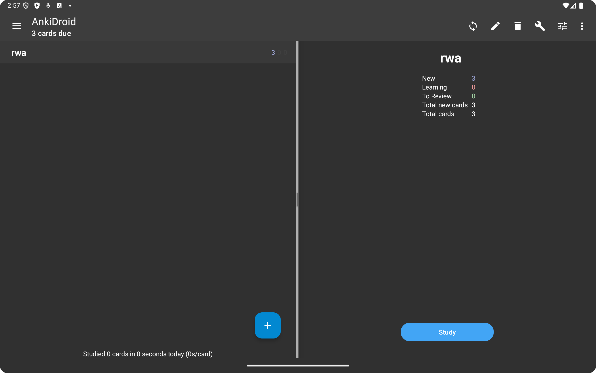
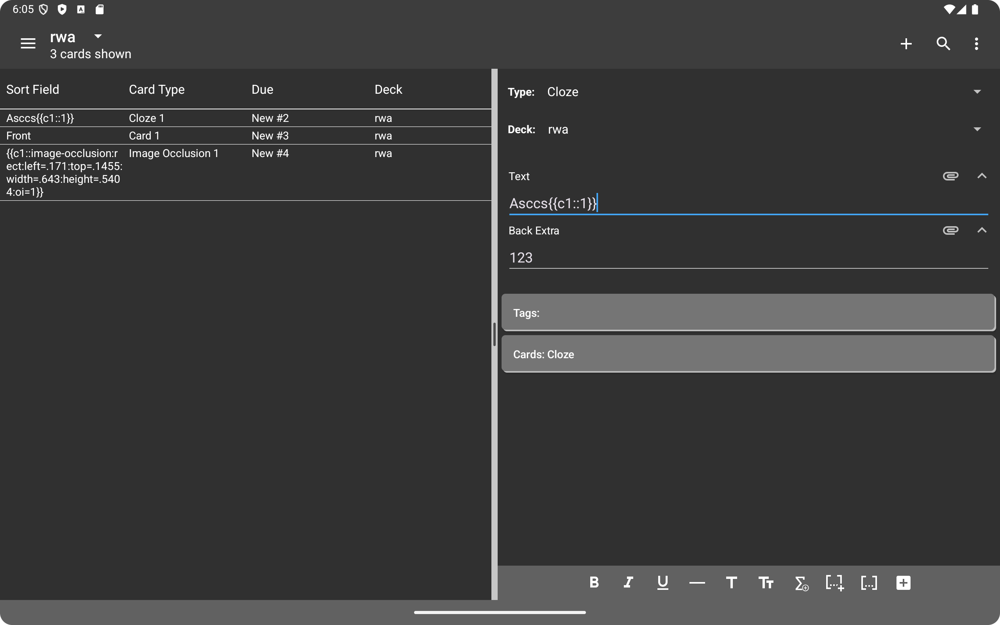
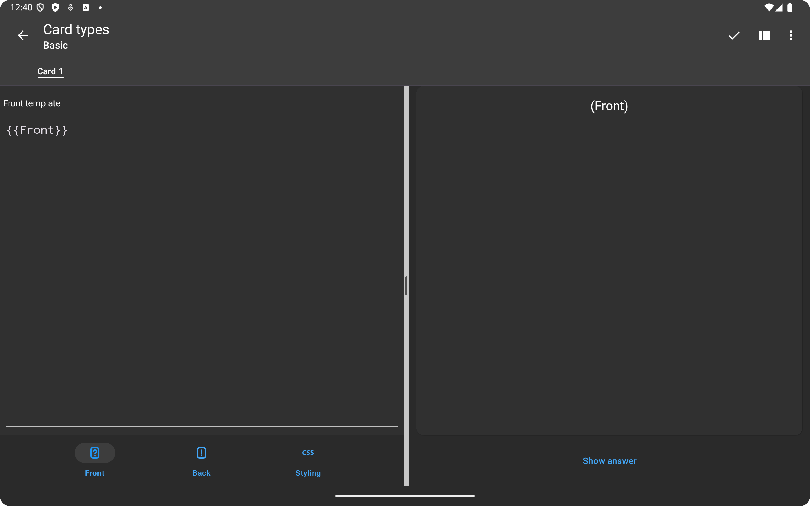
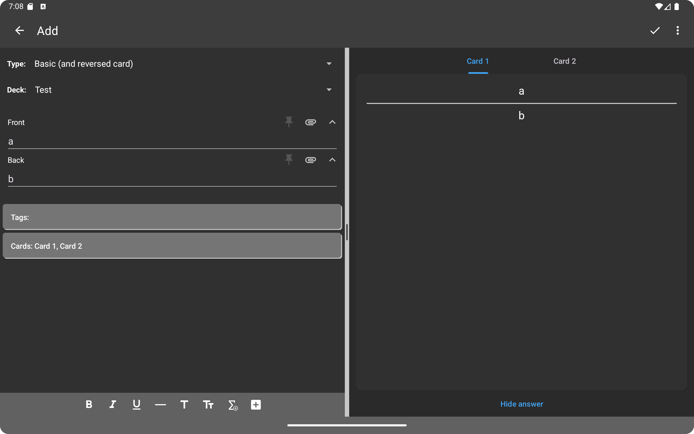

  

<h1 align="center">Hari Srinivasan</h1>
<h2 align="center">Tablet & Chromebook UI - Google Summer of Code 2025</h2>
<h3 align="center">
  <a href="https://github.com/ankidroid/Anki-Android">AnkiDroid</a>
</h3>

  <a href="http://github.com/haz3-jolt">GitHub</a> | 
  <a href="https://www.linkedin.com/in/hhari-srinivasan-b0633a2b8//">LinkedIn</a>

---

## 🧑‍🏫 Mentors
- [Arthur Milchior](https://github.com/Arthur-Milchior)
- [David Allison](https://github.com/david-allison)
- [Sanjay Sargam](https://github.com/SanjaySargam)
- [Shridhar Goel](https://github.com/ShridharGoel)

---

## 📚 Project Overview

[**AnkiDroid**](https://github.com/ankidroid/Anki-Android) is an Android application for [Anki](https://github.com/ankitects/anki), a powerful flashcard program that aids in learning and memorizing various topics through spaced repition and has been proven an effective tool in multiple peer-reviewed studies.

### 🎯 **Project Goal**
My work focused on enhancing the user experience of AnkiDroid on larger devices like tablets and Chromebooks. The project aimed to improve usability, readability, and overall aesthetics, ensuring AnkiDroid remains intuitive and efficient across a wider range of devices and introduce a more desktop-esque UX to more effectively use the larger screen real estate.
---

## 🚀 Project Achievements

### 1. **Resizable Layouts**

Allowing users to resize the panes in any dual fragment layouts.

#### Deck Picker

    

#### Card Browser

    

#### Card Template Editor

    

### 2. **Mouse Improvements**

Improved mouse capabilities with the following:

#### Right Click to select in card browser

#### Hover effects for resizable divider

#### Right Click Context Menus

### 3. **Add Previewer to NoteEditor**

Introduces a dual-pane layout for the Note Editor, integrating a live previewer. Users will be able to edit notes while simultaneously seeing a real-time preview of the generated cards. This change consisteted of many smaller steps including splintering the note editor into a seperate fragment and activity, and creating a interface for the noteeditor to send information on changes to the previewer.

    

---

## 📂 Pull Requests

Here's a list of the pull requests I created during GSoC 2024:

1. [introduces the ResizablePaneManager Utility class to handle all resizable screens and make DeckPicker resizable](https://github.com/ankidroid/Anki-Android/pull/18410)
2. [refactor DeckPicker resizable implementation, and make CardTemplateEditor resizable](https://github.com/ankidroid/Anki-Android/pull/18509)
3. [refactoring Card editor - Deprecate editor Title, wrap in CardView, show focus](https://github.com/ankidroid/Anki-Android/pull/18561)
4. [make cardBrowser Resizable and refactor shared pref of resizable screens into seperate shared pref](https://github.com/ankidroid/Anki-Android/pull/18626)
5. [rename NoteEditor to NoteEditorFragment](https://github.com/ankidroid/Anki-Android/pull/18823)
6. [refactor NoteEditor to use a AnkiActivity instead of SingleFragmentActivity](https://github.com/ankidroid/Anki-Android/pull/18836)
7. [rename note_editor.xml to note_editor_fragment.xml](https://github.com/ankidroid/Anki-Android/pull/18900)
8. [move mainToolbar to NoteEditorActivity and NoteEditorFragment NF cleanup](https://github.com/ankidroid/Anki-Android/pull/18910)
9. [fix: hide save button in fragmented activity to prevent duplication](https://github.com/ankidroid/Anki-Android/pull/18951)
10. [feat: add hover effects to divider in ResizablePaneManager](https://github.com/ankidroid/Anki-Android/pull/18952)
11. [feat: Right click to select in CardBrowser](https://github.com/ankidroid/Anki-Android/pull/18974)
12. [nf: Resizable Screens](https://github.com/ankidroid/Anki-Android/pull/18976)
13. [nf: Rename inFragmentedActivity to inCardBrowserActivity](https://github.com/ankidroid/Anki-Android/pull/19037)
14. [fix(deck-picker): hide resizing divider when collection is empty](https://github.com/ankidroid/Anki-Android/pull/19055)
15. [introduce right click context menus](https://github.com/ankidroid/Anki-Android/pull/19072)
16. [fix(resizable-pane): prevent parent from intercepting touch events during resizing drag](https://github.com/ankidroid/Anki-Android/pull/19106)
17. [Add Previewer to NoteEditor](https://github.com/ankidroid/Anki-Android/pull/18724)

---

## 🏆 Outcome
placeholder

---

## 🔮 Future Work

placeholder
---

*Thank you for following my GSoC journey! Feel free to connect with me on [GitHub](http://github.com/haz3-jolt) or [LinkedIn](https://www.linkedin.com/in/hhari-srinivasan-b0633a2b8//).*
